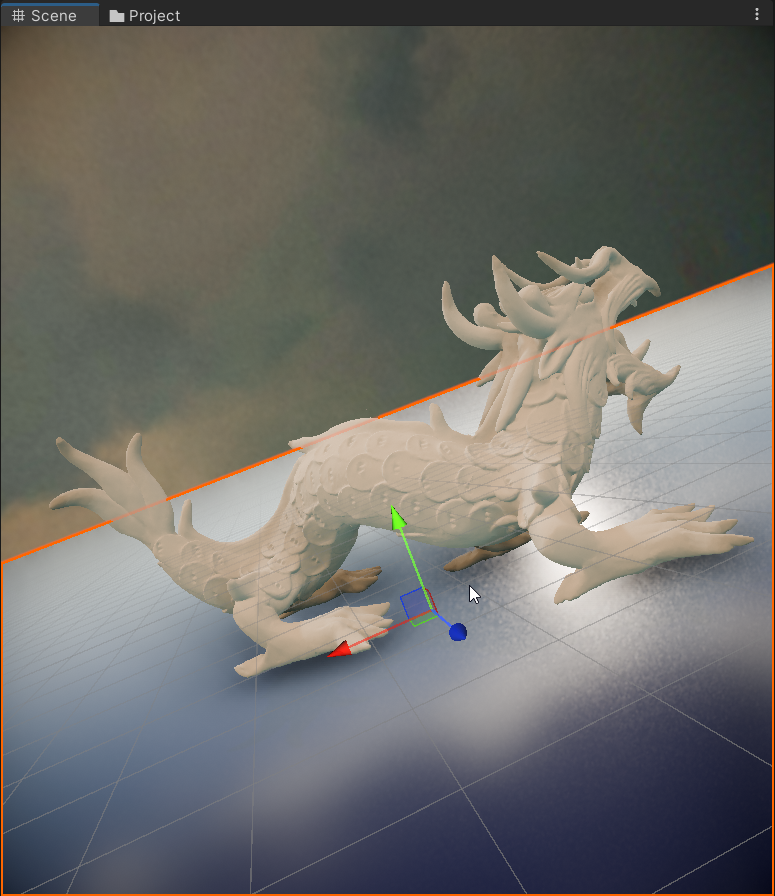
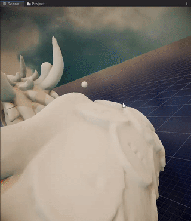
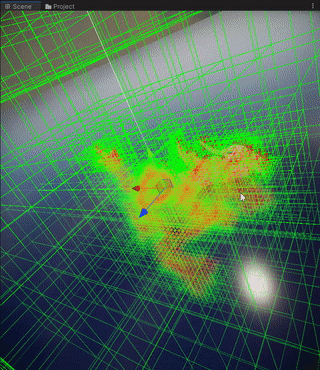
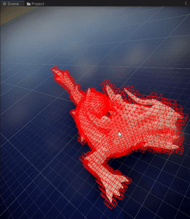
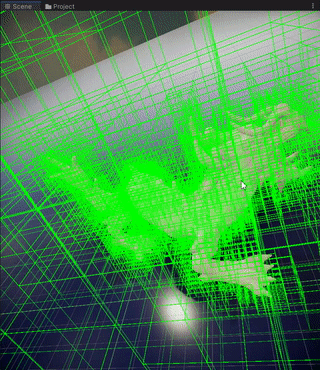
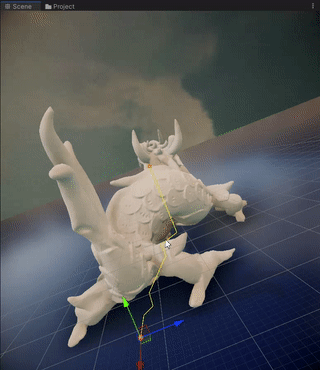
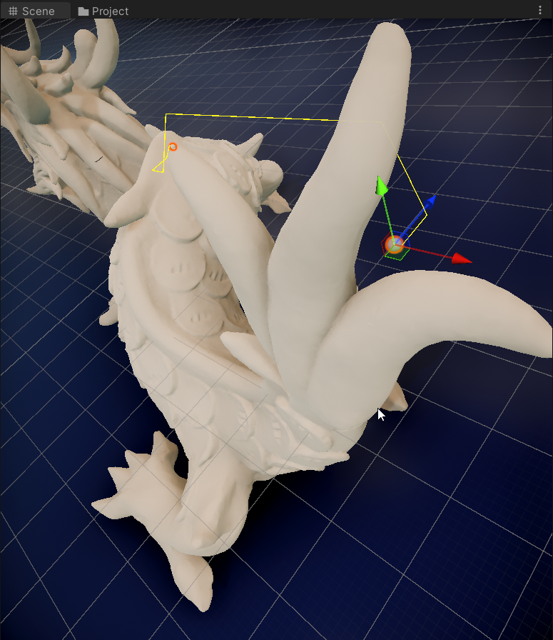
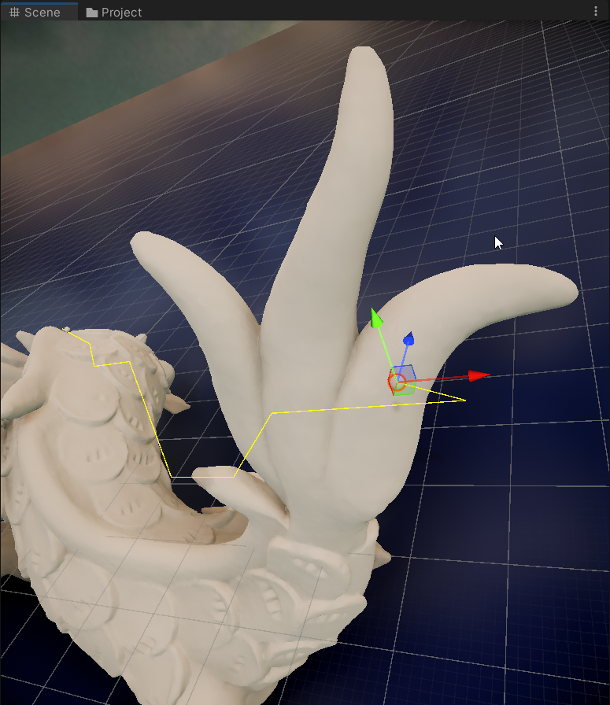

# But Why?

Classic navmesh is performant on 2d surface but cannot handle free 3d space. It definitely cannot handle flying agents such as ingame-birds, robot drones, dragons, etc..
This is an attempt to find a solution to this problem.

# Usage example

```cs
// getting the scene and its bounds
var targetScene = GameObject.Find("xyzrgb_dragon").transform;
var bounds = IrradiancePlacer.CalculateLocalBounds(targetScene, false, true, false, false);
// expanding bounds by a small margin to allow agents to fly/walk more freely
bounds.Expand(300);
// Building Sparsed voxels octree encapsulating geometry inside the bounds
var root = IrradiancePlacer.BuildOctree(bounds, layerMask: 1 << targetScene.gameObject.layer, maxDepth: 4);
// Performing pathfinding on the SVO
var start = GameObject.Find("S1").transform.position;
var end = GameObject.Find("S2").transform.position;
path = oc.FindPath(start, end); // list<vector3> of the points connecting path lines
```
# Vizualisation Example

```cs
private void OnDrawGizmos()
{
    if (path != null) // visualize path
        for (int i = 0; i < path.Count - 1; i++)
        {
            Gizmos.color = Color.yellow;
            Gizmos.DrawLine(path[i], path[i + 1]);
        }

    if (root != null) // visualize octree
        DrawVoxel(root);
}
// recursivelty draw (only the leaves) of the sparse voxel octree
private void DrawVoxel(Voxel voxel)
{
    Gizmos.color = voxel.colliding ? Color.red : Color.green;
    if (!voxel.colliding && voxel.IsLeaf) Gizmos.DrawWireCube(voxel.bounds.center, voxel.bounds.size);

    if (!voxel.IsLeaf)
    {
        foreach (var child in voxel.children)
        {
            if (child != null)
                DrawVoxel(child);
        }
    }
}
```


# Showcase

As an example, we use the `xyzrgb_dragon` model as our level/map, and we place 2 boid sphere agents.

<div align="center">
  
</div>

### Scene Videos (GIFs)

We place the dragon as the level, and spheres as our end/start points. (see code above)
<div align="center">
  
</div>

**SVO**  
<div align="center">
  
  
  
  <br>
  <em>From left to right: all leaf voxels of the octree (colliding + non-colliding), only the colliding voxels, only the free voxels.</em>
</div>


### Path Results for Sphere Agents
<div align="center">
  
  
  
</div>


# How it works? (Non technical simple explanation)
1. Imagine a big cube representing your entire 3D world.  
2. Split it into cubes (this is the startSize=64 param)  
3. Check each smaller cube: is it empty or blocked?  
4. If a cube is partially filled, split it into 8 even smaller cubes.  
5. Keep splitting cubes until you reach the needed detail (this is the octreeMaxDepth=4 param)
6. Now your world is a tree of cubes: big cubes for empty space, small cubes near obstacles.  
7. Pick a starting point in the world.  
8. Pick a goal somewhere else in the world.  
9. Look at the largest cubes around the start and goal.
10. Try to move through big empty cubes first. (this is where performance come from, compared to uniform grid)
11. If you hit a cube that’s partially filled, slow down and look closer.  
12. Move into smaller cubes inside that area. 
13. Keep choosing the biggest empty cubes you can move through.
14. When you get near obstacles, switch to the smallest cubes for precision.
15. Check which neighboring cubes you can move into.
16. Choose the neighbor that seems closest to your goal.
17. Step into that cube and repeat.
18. Each step alternates between moving through big empty spaces and zooming into small tricky areas.
19. Keep doing this until your path reaches the goal.
20. You’ve now found a route that flows through empty space and carefully avoids obstacles.


### Performance
This was more of an experimentation.
Performance can be pretty hefty for a realtime application usage (like per frame or throttled game agent AI)
But then it depends on the Heuristic of the A* (which is by default the Euclidean distance, which is more accurate but slower than Manhattan distance, which is more accurate but slower than Squared Euclidean distance) (all the heuristics are in the cs file)
For instance, on an i7 12k, per path: Euc ~ on avg 20ms, Manh ~ 10ms, SqEuc ~ 1ms, on a 800meter distance between start and end point, with an octree of startSize=64 and depth=4, and a very complex fully fledged production ready level geometry
This is not multithreaded/parallelized by the way. so you can squeeze out more performance out of it.
In the case of multi agent, we can also implement a GPU Compute Shader in which we batch dispatch the Agents points and can get multiple paths in microseconds (for example in a roguelike where there are hundreds of flying monsters) (or in real life controlling hundreds of drones that needs to go thru pre-modeled complex streets or buildings) but that's another thing.
Generally, if you do not care about optimal path, and you want to rather prioritize performance, a steering approach is better.
PS: this is not very optimal as is, for example we can reduce dictionary lookups/hashing by refactoring and using arrays instead. the Voxelization afaik can be entirely bit based using CPU instristics, like that we completely avoid deep hierarchy loops, and get a better CPU cache locality.

### License
Use it as you wish.


### References

Original inspiration is from the 2016 paper `PATHFINDING IN 3D SPACE - A*, THETA*, LAZY THETA* IN OCTREE STRUCTURE` by `Ruoqi He & Chia-Man Hung`.

2006 IEEE `3D Field D*: Improved Path Planning and Replanning in Three Dimensions` by `Joseph Carsten∗, Dave Ferguson, and Anthony Stentz` from `Carnegie Mellon University`
